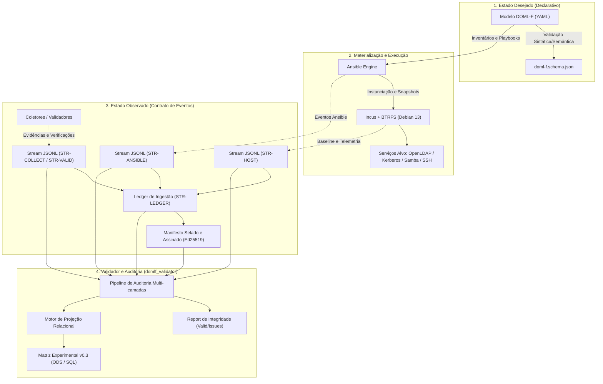
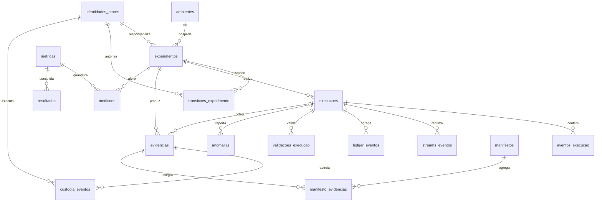

# Documentação Técnica Estruturada: DOML-F (DevOps Modeling Language for Forensic Laboratories)

**Status:** Documento Normativo e Técnico de Arquitetura  
**Versão:** 1.0 (Alinhada à Matriz v0.3 / Contrato de Eventos v0.1)  
**Data:** 2026-09-22  
**Autoridade:** Repositório Oficial DOML-F (`foransi/doml-f`)  

---

## 1. Visão Geral e Fundamentos do Projeto

O **DOML-F** (*DevOps Modeling Language for Forensic Laboratories*) é um ecossistema declarativo, auditável e reprodutível projetado para especificação, implantação, execução, coleta de evidências e auditoria de experimentos em ambientes cibernéticos e computacionais forenses baseados em Linux.

Na prática pericial e de segurança tradicional, ambientes de testes e experimentos sofrem de problemas crônicos de:
1. **Falta de reprodutibilidade:** Diferenças ocultas de versão de pacotes, configurações de sistema operacional e resíduos de execuções prévias;
2. **Fragilidade probatória:** Coleta manual de evidências sem hashes imediatos, sem trilha de custódia rastreável ou com dependência de relógios de parede desregulados;
3. **Acoplamento metodológico:** Mistura entre o que o operador planejou fazer (estado desejado) e o que efetivamente aconteceu (estado observado).

O projeto resolve esses desafios através de uma separação estrita de conceitos:
* **Estado Desejado (Intenção Declarativa):** Modelado formalmente em especificações YAML validadas contra o schema `doml-f.schema.json`. Define alvos, redes, serviços, baselines, cenários e critérios de teste.
* **Materialização Operacional:** Orquestrada via Ansible e instâncias de sistema Incus sobre sistema de arquivos BTRFS no Debian 13.
* **Estado Observado (Fatos Experimentais):** Capturado como um fluxo contínuo de eventos JSON Lines (`.jsonl`), estruturado segundo o contrato `doml-f-event.schema.json`.
* **Projeção Analítica:** Transformação determinística do fluxo JSONL para representações relacionais e tabulares (matriz experimental v0.3 em formato ODS e futuro modelo SQL) sem nunca sobrescrever os eventos originais.



---

## 2. Arquitetura em Camadas da Especificação DOML-F

A especificação DOML-F (`DOML-F-SPEC-v0.1.md`) organiza o laboratório em 5 camadas lógicas independentes:

1. **Meta Layer:** Contém metadados normativos, identificadores do documento, versão da linguagem, schema associado e controle de revisões.
2. **Application Layer:** Descreve abstratamente os serviços de aplicação (ex.: diretório OpenLDAP, KDC MIT Kerberos, compartilhamento Samba, servidores SSH) e regras de negócio sem acoplamento direto à infraestrutura física.
3. **Abstract Infrastructure Layer:** Especifica a topologia lógica: nós (`physical`, `container`, `vm`), redes segregadas por propósito (`management`, `target`, `attack`, `evidence`) e volumes de armazenamento.
4. **Concrete Infrastructure Layer:** Mapeia os elementos abstratos para as tecnologias concretas de materialização: Debian 13.x, Incus 6.x, volumes e subvolumes BTRFS, regras de firewall `nftables` e playbooks Ansible.
5. **Experimental / Forensic Layer:** Define os elementos periciais e científicos de primeira classe:
   * **Cenários (`scenarios`):** Hipóteses periciais, critérios de sucesso/falha e IOCs esperados.
   * **Ataques / Ações Controladas (`attacks`):** Ferramentas, versões, atores, alvos e mecanismos de corte de emergência (*abort*).
   * **Baselines (`baselines`):** Estado de integridade conhecido e verificado pré-execução.
   * **Ground Truth (`ground_truth`):** A verdade fundamental gerada deliberadamente pelo teste, servindo de gabarito para aferir completude da coleta forense.
   * **Evidências e Custódia (`evidence`, `custody_events`):** Registro de artefatos digitais, hashes SHA-256 e trilha de custódia alinhada à norma ISO/IEC 27037:2012.
   * **Manifestos (`manifests`):** Selos criptográficos que amarram artefatos, hashes e contexto.

---

## 3. Estrutura e Funcionalidades dos Códigos do Sistema (`src/domlf_validator/`)

O validador oficial (`src/domlf_validator/`) implementa um motor de validação por camadas e um projetor relacional semântico. A seguir, detalham-se as responsabilidades, classes, métodos e lógicas de cada módulo estruturado:

```
src/domlf_validator/
├── __init__.py         # Pacote e exportações públicas
├── __main__.py         # Ponto de entrada para execução com python -m domlf_validator
├── cli.py              # Interface de linha de comando (argparse)
├── model.py            # Estruturas de dados: Issue e Report
├── parser.py           # Parser estrito RFC 7493 (I-JSON)
├── canonical.py        # Canonicalização JCS RFC 8785 e cálculo de SHA-256
├── schema.py           # Validação sintática via JSON Schema Draft 2020-12
├── streams.py          # Validação de streams encadeados e integridade de sequência
├── ledger.py           # Validação do livro-razão de ingestão (ledger) assíncrono
├── semantic.py         # Validação de causalidade, clocks e correções imutáveis
├── manifest.py         # Verificação estrutural de manifestos selados
├── projection.py       # Motor de projeção JSON Pointer para tabelas relacionais
└── audit.py            # Orquestração do pipeline completo de auditoria
```

### 3.1 `model.py` — Estruturas de Dados do Diagnóstico

Define as classes de diagnóstico de problemas e compilação do relatório pericial:

* **Classe `Issue` (Slots Dataclass):**
  * Representa uma ocorrência ou violação encontrada durante a auditoria.
  * **Atributos:**
    * `code: str`: Código padronizado do erro (ex.: `EVENT_HASH_MISMATCH`, `STREAM_HASH_CHAIN`, `LEDGER_SEQUENCE_GAP`).
    * `severity: str`: Nível de severidade: `"ERROR"` (invalida o experimento) ou `"WARNING"` (aviso de dependência ou observação).
    * `message: str`: Mensagem descritiva detalhando o desvio.
    * `line: int | None`: Número da linha física no arquivo JSONL (quando aplicável).
    * `event_id: str | None`: UUID do evento que originou o problema.
    * `stream_id: str | None`: Identificador do stream afetado.
    * `path: str | None`: Caminho JSON Pointer onde a validação de schema falhou.
  * **Método `to_dict()`:** Converte a instância em dicionário, omitindo chaves com valores nulos.

* **Classe `Report` (Slots Dataclass):**
  * Consolida as métricas e o veredito final da auditoria.
  * **Atributos:** `issues`, `events_checked`, `streams_checked`, `ledger_entries`, `evidence_checked`, `manifest_verified`.
  * **Propriedades calculadas:**
    * `errors`: Total de issues com severidade `ERROR`.
    * `warnings`: Total de issues com severidade `WARNING`.
    * `valid`: Booleano estrito (`errors == 0`).
  * **Método `to_dict()`:** Retorna o sumário auditável em formato serializável para JSON.

### 3.2 `parser.py` — Parser Estrito em Conformidade com RFC 7493 (I-JSON)

Garante que o fluxo observacional JSONL seja imune a ataques de ambiguidades sintáticas JSON e truncamentos de precisão numérica:

* **Constante `MAX_SAFE_INTEGER = 9_007_199_254_740_991` ($2^{53} - 1$):** Limite de inteiros seguros segundo a norma I-JSON (RFC 7493) e IEEE 754.
* **Função `_pairs(pairs)`:** Hook para `object_pairs_hook`. Lança `DuplicateKeyError` se qualquer chave for repetida dentro do mesmo objeto JSON, impedindo discrepâncias de interpretação entre parsers.
* **Função `_int(value)`:** Hook de parsing inteiro. Se o valor absoluto ultrapassar `MAX_SAFE_INTEGER`, emite `ValueError`. Contadores de altíssima precisão (como nanossegundos) devem trafegar como string decimal.
* **Função `_constant(value)`:** Bloqueia terminantemente constantes fora de padrão (`NaN`, `Infinity`, `-Infinity`).
* **Função `parse_line(text)`:** Executa `json.loads` com os hooks estritos, exigindo que cada linha seja obrigatoriamente um `dict`.
* **Função `load_jsonl(path)`:** Lê o arquivo com codificação UTF-8 estrita (`errors="strict"`), detecta linhas em branco acidentais (`EMPTY_LINE`) e acumula parsing issues (`JSON_PARSE_ERROR`).

### 3.3 `canonical.py` — Canonicalização Determinística e Hashing Criptográfico

Fornece a base criptográfica para verificação de não-repúdio e integridade:

* **RFC 8785 (JCS - JSON Canonicalization Scheme):**
  * A função `canonical_bytes(value)` utiliza o módulo `rfc8785` para gerar a representação canônica exata em bytes.
  * Ordena chaves lexicograficamente em UTF-16 code units, elimina espaços em branco irrelevantes e padroniza a formatação numérica.
* **Função `hashable_event(event)`:**
  * Gera uma cópia profunda do evento e remove estritamente os campos autorreferenciais: `integrity.event_hash` e `integrity.signature`.
* **Função `calculate_event_hash(event)`:**
  * Retorna o hash SHA-256 hexadecimal calculado sobre os bytes canônicos de `hashable_event(event)`.
* **Função `validate_hashes(events)`:**
  * Percorre todos os eventos do log e recalcula o hash. Se houver discrepância entre o hash declarado no envelope e o calculado, emite a issue crítica `EVENT_HASH_MISMATCH`.

### 3.4 `schema.py` — Validação Sintática por JSON Schema

* **Função `validate_schema(events, schema_path)`:**
  * Compila o schema executável utilizando `jsonschema.Draft202012Validator` e `FormatChecker()`.
  * Valida cada evento linha a linha, cobrindo o envelope genérico e as regras condicionais (`allOf` + `if/then`) específicas de cada um dos 15 tipos de payload.
  * Mapeia qualquer não-conformidade para a issue `SCHEMA_INVALID`, registrando o JSON Pointer preciso do campo com falha.

### 3.5 `streams.py` — Validação de Cadeias de Streams Independentes

O DOML-F reconhece que emissores distribuídos em diferentes hosts não compartilham uma sequência única síncrona. Cada emissor gera seu próprio stream:

* **Função `validate_streams(events)`:**
  1. Agrupa os eventos por `stream.stream_id`.
  2. Verifica se há colisões de identificador global (`DUPLICATE_EVENT_ID`).
  3. Ordena os eventos internamente pela `stream_sequence`.
  4. Valida a invariância de identidade: `(emitter_type, emitter_instance_id, host, boot_id)` deve ser perfeitamente estático ao longo do mesmo stream. Caso contrário, emite `STREAM_IDENTITY_CHANGED`. Um reboot ou reinício de processo exige um novo `stream_id`.
  5. Valida a sequência estrita: a sequência deve iniciar em 1 e incrementar de 1 em 1 sem falhas (`STREAM_SEQUENCE_GAP`).
  6. Valida o encadeamento de hashes (*hash chain* local):
     * O primeiro evento de cada stream deve declarar `previous_event_hash: null`.
     * Cada evento subsequente deve ter `previous_event_hash` exatamente igual ao `event_hash` do evento imediatamente anterior (`STREAM_HASH_CHAIN`).

### 3.6 `ledger.py` — Validação do Livro-Razão de Ingestão Assíncrona

Como streams locais não provam ordem física absoluta global entre nós distintos, o nó agregador (`controller-01`) consome os eventos e emite registros em um stream de ledger (`ledger.event.accepted`):

* **Função `validate_ledger(events, require_complete)`:**
  1. Filtra os eventos de tipo `ledger.event.accepted` e ordena por `payload.ledger_sequence`.
  2. Assegura sequência contígua sem lacunas (`LEDGER_SEQUENCE_GAP`).
  3. Verifica a existência do evento de origem (`source_event_id`) no log (`LEDGER_TARGET_NOT_FOUND`).
  4. Impede que o mesmo evento de origem seja aceito mais de uma vez (`LEDGER_DUPLICATE_ACCEPTANCE`).
  5. Valida a prova cruzada imutável: confere se `source_stream_id`, `source_stream_sequence` e `source_event_hash` gravados no ledger coincidem byte a byte com o evento original correspondente (`LEDGER_REFERENCE_MISMATCH`).
  6. Verificação de completude opcional (`require_complete=True`): Assegura que nenhum evento operacional tenha ficado de fora do ledger oficial (`LEDGER_EVENT_MISSING`).

### 3.7 `semantic.py` — Validação Semântica, Temporal e Causal

Aplica regras de coerência pericial e regras de negócio:

* **Causalidade (`causation_id`):** Valida se todo evento que declara causalidade aponta para um `event_id` pré-existente (`CAUSATION_NOT_FOUND`).
* **Emparelhamento de Etapas (`step.started` $\leftrightarrow$ `step.finished`):**
  * Rastreia eventos de execução pelo `evento_id` da etapa.
  * Detecta finalizações órfãs (`STEP_START_NOT_FOUND`).
  * Valida a integridade do cálculo temporal: a duração monotônica declarada em milissegundos (`duracao_ms`) deve coincidir com $(fim\_monotonico\_ns - inicio\_monotonico\_ns) / 1.000.000$ (`DURATION_MISMATCH`). Clocks monotônicos eliminam flutuações de NTP/leap seconds.
* **Correções Imutáveis (`record.corrected`):**
  * O princípio pericial proíbe reescrever registros aceitos. Erros são retificados através de um evento explícito `record.corrected`.
  * Valida se o evento alvo existe (`CORRECTION_TARGET_NOT_FOUND`).
  * Valida se o `target_event_hash` declarado corresponde ao hash original registrado (`CORRECTION_HASH_MISMATCH`), garantindo que o operador estava ciente da versão exata que estava retificando.

### 3.8 `manifest.py` — Validação Estrutural de Manifestos Selados

Verifica o evento de selamento final do experimento (`manifest.sealed`):

* **Função `validate_manifests(events)`:**
  * Examina o sumário de cada stream declarado no manifesto: confere `first_sequence`, `last_sequence`, `event_count`, `first_hash` e `last_hash` contra os dados reais observados (`MANIFEST_STREAM_NOT_FOUND` e `MANIFEST_STREAM_MISMATCH`).
  * Valida se o `ledger_hash` declarado no manifesto coincide com o hash do último evento registrado no stream do ledger (`STR-LEDGER-01`), fechando a cadeia criptográfica de ponta a ponta.

### 3.9 `projection.py` — Motor de Projeção Relacional Declarativo

Implementa a transformação determinística do fluxo JSONL em tabelas bidimensionais semânticas (especificadas em YAML):

* **JSON Pointer (`pointer()`):** Implementa a RFC 6901 com suporte a ponteiros absolutos (`/payload/item`) e relativos (`./subitem`), incluindo escape de caracteres especiais (`~1` para `/`, `~0` para `~`).
* **Resolução de Campos (`resolve()`):** Suporta extração de ponteiros ou injeção de literais estáticos (`constant`).
* **Operações Suportadas:**
  * `create`: Cria a linha na tabela de destino indexada por chave primária única.
  * `finalize`: Atualiza uma linha existente (ex.: inserindo `fim_utc`, status de encerramento e calculando durações derivadas), garantindo proteção de campos imutáveis (`immutable_fields`).
  * `append`: Adiciona entradas em tabelas de histórico ou listas.
* **Perfis de Proveniência (`provenance_profiles`):**
  * `simple`: Injeta em cada linha projetada `source_event_id`, `source_stream_id`, `source_event_hash` e `projection_version`.
  * `lifecycle_create` / `lifecycle_finalize`: Preserva separadamente o par `created_*` e `finalized_*` para entidades com ciclo de vida (como execuções e etapas), garantindo que qualquer auditor possa traçar a origem exata de cada célula na planilha ODS.

### 3.10 `audit.py` e `cli.py` — Orquestração e Linha de Comando

* **Função `audit()`:**
  * Executa em sequência coordenada: carga do arquivo $\rightarrow$ validação de schema $\rightarrow$ verificação de integridade JCS/SHA-256 $\rightarrow$ validação de streams $\rightarrow$ validação semântica $\rightarrow$ validação do ledger $\rightarrow$ validação do manifesto $\rightarrow$ cômputo de evidências.
* **Comando `domlf-validate`:**
  * CLI executável via terminal que recebe argumentos (`jsonl`, `--schema`, `--skip-crypto`, `--require-complete-ledger`, `--json-report`), gerando relatório estruturado em JSON e código de saída Unix adequado para pipelines de CI/CD periciais.

---

## 4. O Contrato de Eventos Observacionais (`schemas/doml-f-event.schema.json`)

O contrato de eventos padroniza 15 tipos fundamentais de fatos observáveis:

| Categoria | Tipo de Evento | Emissor Típico | Finalidade Pericial / Metodológica |
|---|---|---|---|
| **Ciclo Metodológico** | `experiment.transitioned` | Orquestrador | Transição da máquina de estados do experimento (`DRAFT` $\rightarrow$ `VALIDATED` $\rightarrow$ `READY` $\rightarrow$ `RUNNING` $\rightarrow$ etc.) |
| **Execução** | `execution.started` | Orquestrador | Disparo da execução com timestamps, parâmetros e ator autenticado |
| **Execução** | `execution.step.started` | Ansible Callback | Abertura de etapa ou task Ansible com início monotônico |
| **Execução** | `execution.step.finished` | Ansible Callback | Fechamento de etapa, status de saída, tempo monotônico e intervenções |
| **Execução** | `execution.completed` | Orquestrador | Fechamento da execução com métricas agregadas e veredito |
| **Evidências Digitais** | `evidence.registered` | Coletor Forense | Registro formal de artefato digital, caminho, tipo, tamanho e hash SHA-256 |
| **Cadeia de Custódia** | `custody.recorded` | Coletor / Selador | Ação de custódia ISO/IEC 27037 (coleta, selamento, cópia, verificação, etc.) |
| **Métricas** | `measurement.recorded` | Agente Medidor | Registro de métrica escalar (tempo de resposta, ocupação de disco, etc.) |
| **Validações** | `validation.completed` | Validador | Registro de aprovação em portão pré-voo sintático/semântico ou verificação funcional |
| **Inconsistências** | `anomaly.recorded` | Orquestrador / Analista | Registro de anomalia ou desvio operacional ocorrido durante o teste |
| **Drift** | `divergence.detected` | Comparador | Detecção de drift de configuração não intencional entre estado desejado e observado |
| **Ground Truth** | `detection_test.completed` | Orquestrador / Auditor | Teste deliberado de alteração com tempo e método de detecção aferidos |
| **Ingestão** | `ledger.event.accepted` | Agregador | Entrada ordenada no livro-razão comprovando recepção e hash de evento |
| **Integridade** | `manifest.sealed` | Selador | Selamento formal dos streams, ledger, lista ordenada de evidências e assinatura |
| **Retificação** | `record.corrected` | Analista Autorizado | Retificação imutável referenciando evento e hash originais com justificativa |

### Envelope Padrão de Todo Evento

```json
{
  "schema_version": "0.1.0",
  "event_id": "018f0000-0000-7000-8000-000000000001",
  "event_type": "execution.started",
  "stream": {
    "stream_id": "STR-ORCH-01",
    "emitter_type": "orchestrator",
    "emitter_instance_id": "orchestrator-controller-01",
    "host": "controller-01",
    "boot_id": "boot-a"
  },
  "stream_sequence": 1,
  "emitted_at_utc": "2026-09-20T12:00:00.000Z",
  "monotonic_ns": "1000000000",
  "source": {
    "emitter": "orchestrator",
    "host": "controller-01",
    "process_id": 4200,
    "software_version": "0.1.0"
  },
  "context": {
    "exp": "EXP-001",
    "execucao_id": "EXEC-001",
    "doml_model_id": "lab-forense-01",
    "doml_version": "0.1.0",
    "doml_hash": "sha256:aaaaaaaaaaaaaaaaaaaaaaaaaaaaaaaaaaaaaaaaaaaaaaaaaaaaaaaaaaaaaaaa",
    "commit": "0123456789abcdef0123456789abcdef01234567"
  },
  "actor": {
    "ator_id": "ACT-SVC-ORCH",
    "principal": "forensic-orchestrator@LAB.LOCAL",
    "authentication_method": "KERBEROS_SSH",
    "ssh_key_fingerprint": "SHA256:example"
  },
  "integrity": {
    "algorithm": "SHA-256",
    "previous_event_hash": null,
    "event_hash": "bbbbbbbbbbbbbbbbbbbbbbbbbbbbbbbbbbbbbbbbbbbbbbbbbbbbbbbbbbbbbbbb"
  },
  "payload": {
    "numero_execucao": 1,
    "status": "EM_EXECUCAO",
    "inicio_monotonico_ns": "1000000000"
  }
}
```

---

## 5. Modelo Relacional da Matriz Experimental v0.3 (`models/modelo-matriz-v0.3.md`)

O modelo lógico da matriz experimental v0.3 estrutura os dados coletados em **23 entidades relacionais** coordenadas, agrupadas por domínio funcional:



### 5.1 Entidades de Infraestrutura e Identidade
1. **`ambientes`:** Configurações físicas e lógicas dos nós (hardware, kernel, SO, BTRFS, Incus, hashes de ruleset `nftables` e configuração de rede).
2. **`identidades_atores`:** Pessoas, operadores, contas de serviço e coletores autenticados no ecossistema AAA (Kerberos/LDAP/SSH), armazenando apenas principals e fingerprints de chaves/certificados, jamais segredos.

### 5.2 Entidades de Ciclo de Vida Experimental
3. **`experimentos`:** A unidade metodológica global com revisões de commit (DOML, Ansible, protocolos, validador) e hashes de inventário.
4. **`transicoes_experimento`:** Histórico completo de auditoria das mudanças de estado da máquina do experimento.
5. **`execucoes`:** Realizações pontuais de um experimento, marcadas por contadores de execução, status e intervenções.
6. **`eventos_execucao`:** Log detalhado de cada etapa ou playbook executado, combinando marcação cronológica UTC e relógio monotônico local.

### 5.3 Entidades do Mecanismo de Integridade e Ledger
7. **`streams_eventos`:** Registro estruturado de cada stream emissor ativo (instância, boot, host, primeira/última sequência, hashes inicial e final).
8. **`ledger_eventos`:** Registro sequencial das aceitações de eventos no agregador, provando a cronologia de recepção e vinculação ao stream original.
9. **`correcoes_registro`:** Projeção de eventos retificadores `record.corrected` contendo referência ao hash anterior e justificativa pericial.

### 5.4 Entidades de Evidências, Custódia e Manifestos
10. **`evidencias`:** Metadados periciais completos dos artefatos preservados (método de coleta, ferramenta, caminho, hash SHA-256, classe de armazenamento).
11. **`custodia_eventos`:** Trilha de custódia ISO/IEC 27037:2012 (identificação, coleta, aquisição, preservação, transferências, análises e descarte).
12. **`manifestos`:** Conjuntos de selamento vinculando streams, hashes de ledger, evidências e assinatura criptográfica Ed25519.
13. **`manifesto_evidencias`:** Tabela associativa entre manifestos e evidências com ordem e conferência de hashes no instante do selamento.

### 5.5 Entidades de Verificação, Drift e Telemetria
14. **`validacoes_modelo`:** Portão pré-provisionamento avaliando conformidade sintática, semântica e forense do modelo DOML-F.
15. **`validacoes_execucao`:** Testes funcionais e forenses em tempo de execução (OpenLDAP, Kerberos, Samba, SSH).
16. **`idempotencia`:** Registro de reexecuções de playbooks para verificar ausência de alterações indesejadas.
17. **`reproducao`:** Comparação pareada entre execuções em hosts de réplica e hosts de origem.
18. **`divergencias`:** Drifts observados em relação ao estado desejado.
19. **`testes_deteccao`:** Testes deliberados de injeção de anomalias/alterações controladas para medir tempo de detecção pericial.
20. **`anomalias`:** Incidentes e eventos não planejados no ambiente.
21. **`metricas`:** Dicionário com definições conceituais e fórmulas de cálculo de métricas.
22. **`medicoes`:** Valores pontuais observados em cada execução.
23. **`resultados`:** Consolidações estatísticas (médias, medianas, intervalos de confiança de 95%) dos experimentos.

---

## 6. Mecanismos e Garantias Forenses de Segurança

### 6.1 Trilha de Custódia Alinhada à ISO/IEC 27037:2012
A gestão de evidências no DOML-F adota as fases normativas internacionais:
* **Identificação:** Reconhecimento do ativo ou log relevante no host alvo.
* **Coleta / Aquisição:** Obtenção imediata através de ferramentas controladas (`doml-f-collector`, exportadores dedicados, snapshots Incus/BTRFS) com cômputo concorrente de hash SHA-256.
* **Preservação e Armazenamento em Camadas:**
  * `LOCAL_OPERACIONAL`: Armazenamento temporário nos alvos (limitado estritamente a 150 GB por host).
  * `REMOTO_NFS`: Repositório de preservação consolidada (4 a 8 TB) tratado como infraestrutura de apoio, sem impactar métricas funcionais. A transferência só é homologada se `hash_origem == hash_destino`.
  * `REFERENCIA_EXTERNA`: Evidências volumosas preservadas externamente, representadas por URI, tamanho e hash.
  * `DESCARTADA`: Conteúdo expurgado mediante autorização explícita, preservando permanentemente os metadados históricos de custódia.

### 6.2 Controle Temporal e Eliminação de Flutuações
* **Correlação Global:** Mantida via UTC ISO 8601, com sincronização contínua por `ntpsec` contra fonte primária de rede local. Desvio temporal acima de 1 segundo bloqueia ou aborta imediatamente o experimento.
* **Duração de Etapas:** Medida exclusivamente através de relógios monotônicos locais (`inicio_monotonico_ns` e `fim_monotonico_ns`), expressos como strings decimais para preservar precisão além de 53 bits e evitar distorções decorrentes de ajustes de passo de NTP.

### 6.3 Segregação de Rede e Isolamento de Experimentos
* O piloto opera em 3 hosts físicos equivalentes (`foransi-host-01`, `02` e `03`) gerenciados por um controlador dedicado (`foransi-host-00`).
* As redes Incus utilizam blocos `/24` não sobrepostos (`10.179.1.0/24`, `10.179.2.0/24`, `10.179.3.0/24`) roteados sobre a rede física (`10.127.0.0/20`), sem necessidade de VLANs complexas de switch físico.
* A filtragem por `nftables` garante que ferramentas da rede de ataque (`net-attack`) não tenham tráfego desimpedido para o repositório de evidências (`net-evidence`) nem para a Internet.

---

## 7. Portões Automáticos de Pré-Voo (Preflight Gates G01–G12) e Classificação de Falhas

### 7.1 Portões de Pré-Voo Determinísticos
Nenhum experimento ou cenário piloto pode ser iniciado sem a aprovação estrita dos 12 portões automáticos (*preflight gates*), conforme estabelecido no procedimento operacional `checklist.md`:

| Portão | Identificador | Requisito Operacional e Critério de Aceite | Bloqueio / Falha |
|---|---|---|---|
| **`G01`** | Identidade e Nomes | Nomes físicos corretos e FQDN no TLD reservado `.test` (RFC 6761), ex.: `foransi-host-00.foransi.test`. | Hostname incorreto ou TLD não reservado. |
| **`G02`** | Hardware e Versões | Debian 13.7, kernel 6.12, 4 vCPU, RAM $\ge 15$ GiB nos alvos, BTRFS e Incus 6.0.4 homogêneos. | Disparidade de kernel ou pacotes de base. |
| **`G03`** | Sincronização de Tempo | NTPsec contínuo, peer selecionado (`*`), `reach` estável e offset absoluto $\|offset\| \le 1,0$ s. | Offset $> 1$ s, reach nulo ou saltos recorrentes (*time stepped*). |
| **`G04`** | Integridade do Git | Repositório estritamente limpo (`git status` limpo) e commits registrados. | Presença de arquivos *untracked* ou modificações não congeladas. |
| **`G05`** | Imagem de Contêiner | Mesma imagem Debian Incus com SHA-256 e fingerprint idênticos nos três hosts alvos. | Discrepância de imagem ou hash do artefato. |
| **`G06`** | Ausência Residual | Instâncias `idp-01`, `files-01` e `client-01` comprovadamente ausentes antes do C01. | Contêineres pré-existentes ou resíduos de testes anteriores. |
| **`G07`** | Rede e Roteamento | Sub-redes Incus `/24` não sobrepostas (`10.179.1-3.0/24`), rotas explícitas e `nftables` ativos. | Comunicação indevida para produção ou Internet. |
| **`G08`** | Armazenamento Local | Subvolume BTRFS dedicado para o Incus e ocupação operacional $\le 150$ GB por host. | Uso próximo ao limite ou pool loop-backed padrão. |
| **`G09`** | Repositório Remoto | Montagem NFS (4 a 8 TB) acessível e teste atômico de escrita, hash e leitura válido. | Falha de conectividade ou divergência de hash. |
| **`G10`** | Automação e Credenciais| SSH Ed25519 exclusivo, login direto de root desativado e Ansible Vault operacional. | Autenticação por senha ativa ou falha de chave. |
| **`G11`** | Validação DOML-F | Modelo YAML validado sintática, semântica e forensemente pelo validador. | Violação de schema ou invariante do modelo. |
| **`G12`** | Inicialização de Trilha | Emissão de IDs UUIDv4, abertura dos streams locais e diretório `EXP-xxxx/` criado. | Colisão de IDs ou falha de permissão de escrita. |

### 7.2 Classificação Normativa de Falhas: Pré-Condição vs. Falha Experimental
Para preservar a integridade científica e evitar distorções estatísticas, o DOML-F estabelece uma separação rigorosa entre dois tipos de ocorrência:
1. **Falha de Pré-Condição de Infraestrutura (ex.: Incidente PRE-C01-20260926-TIME):**
   * Ocorre antes da instanciação dos serviços e do início formal do cenário.
   * Exemplos: instabilidade de oscilador de hardware/clocksource, desvio de NTP $>1$ s, indisponibilidade de NFS, falha de rede física.
   * **Tratamento:** O experimento é imediatamente suspenso. O evento **NÃO é computado** como falha de implantação, idempotência ou reprodução do C01. O ambiente é preservado sem contaminação probatória.
2. **Falha Experimental Válida:**
   * Ocorre durante a execução do cenário após a aprovação de todos os portões de pré-voo.
   * Causada pelo objeto avaliado (DOML-F, playbook Ansible, serviço OpenLDAP/Kerberos/Samba/SSH ou validador).
   * **Tratamento:** A execução é registrada integralmente, computada na amostra estatística e analisada como resultado legítimo do teste.

### 7.3 Arquitetura de Temporização em Redes Isoladas e Controle de Clocksource
* **NTP Local em Redes Segregadas:** Em ambientes periciais isolados sem acesso a pools públicos da Internet (`pool.ntp.org`), o controlador dedicado `foransi-host-00` (`10.127.0.10`) deve atuar como servidor NTP intermediário para os hosts alvos. A configuração deve usar exclusivamente diretivas `server 10.127.0.10 iburst prefer`, evitando diretivas redundantes `pool` que criam associações duplicadas.
* **Auditoria de Clocksource:** A sincronização por software depende da estabilidade do contador de hardware do kernel Linux (`/sys/devices/system/clocksource/clocksource0/`). Instabilidades em contadores TSC (*Time Stamp Counter*) causadas por variações térmicas ou gerenciamento dinâmico de energia de processadores exigem teste comparativo com HPET (*High Precision Event Timer*) para eliminar derivas anômalas (como derivas severas de 500 ppm).

