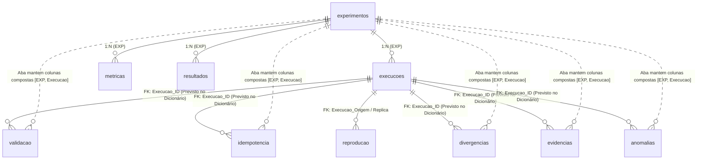
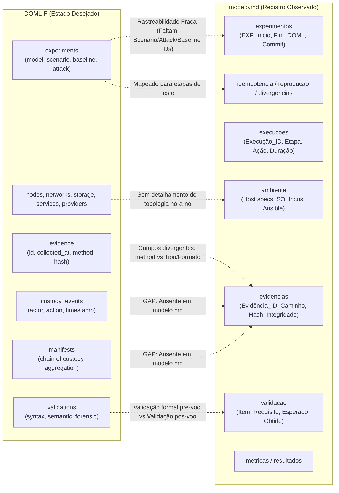

# Relatório Técnico de Avaliação Forense, Extração Estrutural e Divergências

**Projeto:** Laboratório Forense Replicável / DOML-F (*DevOps Modeling Language for Forensic Laboratories*)  
**Escopo da Análise:** Avaliação do diretório, consistência de artefatos, extração estrutural, alinhamento DOML-F vs. `modelo.md` (abas e dicionário de dados) e levantamento minucioso de divergências.  
**Data da Auditoria:** 2026-09-17  
**Status do Repositório:** Versão 0.1 (pré-implementação de executores / starter)

---

## 1. Contexto e Avaliação do Diretório

O projeto tem como finalidade estabelecer um **ambiente e modelo forense de implementação de sistemas para auditoria, replicação e testes** baseados em Debian 13, containers e VMs Incus, storage BTRFS, orquestração via Ansible e gestão de identidade centralizada com OpenLDAP + Kerberos MIT.

O ecossistema é projetado para operar sob uma rigorosa separação entre:
1. **Modelo Declarativo (Fonte da Verdade / Estado Desejado):** A especificação [DOML-F-SPEC-v0.1.md](file:///home/marconi/antigravity/excited-volta/v-0.1/DOML-F-SPEC-v0.1.md), formalizada pelo schema [doml-f.schema.json](file:///home/marconi/antigravity/excited-volta/v-0.1/doml-f.schema.json) e instanciada em [doml-f.example.yaml](file:///home/marconi/antigravity/excited-volta/v-0.1/doml-f.example.yaml).
2. **Matriz de Execução, Observação e Auditoria Experimental:** Representada por [modelo.md](file:///home/marconi/antigravity/excited-volta/modelo.md) e pelas planilhas ODS em [v-0.1/02-experimentos](file:///home/marconi/antigravity/excited-volta/v-0.1/02-experimentos), destinadas ao registro de cada execução, validação de requisitos, iterações de idempotência, testes de réplica, evidências, anomalias e métricas consolidadas.

### 1.1 Mapeamento e Integridade dos Artefatos

```
.
├── modelo.md                                  # Matriz experimental e dicionário de dados (11 abas + 1 dicionário)
├── requisitos.md                              # Especificação normativa de requisitos (325 requisitos catalogados)
└── v-0.1/
    ├── 01-protocolo/                          # [VAZIO] Destinado aos roteiros e protocolos de execução
    ├── 02-experimentos/
    │   ├── matriz-experimental-v0.1.ods       # Planilha ODS v0.1 (legado com abas não-normalizadas)
    │   └── matriz-experimental-v0.2.ods       # Planilha ODS v0.2 (fonte binária correspondente a modelo.md)
    ├── 03-evidencias/                         # [VAZIO] Destinado ao repositório de evidências coletadas e hashes
    ├── 04-analise/
    │   ├── resultados/                        # [VAZIO] Destinado a saídas analíticas consolidadas
    │   └── scripts/                           # [VAZIO] Destinado a scripts de validação e métricas
    ├── DOML-F-SPEC-v0.1.md                    # Especificação da linguagem DOML-F (27 seções, 16 invariantes, 60 regras)
    ├── DOML-F-TRACEABILITY-v0.1.md            # Matriz de rastreabilidade (requisitos -> componentes DOML -> regras)
    ├── README.md                              # Roadmap com 10 passos técnicos de implementação
    ├── doml-f.example.yaml                    # Exemplo mínimo funcional (lab-ssh-minimal)
    └── doml-f.schema.json                     # JSON Schema Draft 2020-12 da linguagem DOML-F
```

> [!WARNING]
> **Status de Versionamento (Git):** O repositório Git possui apenas um commit inicial vazio (`Initial commit`). Todos os artefatos funcionais (`requisitos.md`, `modelo.md` e a pasta `v-0.1/`) encontram-se atualmente na condição de arquivos não rastreados (*untracked files*).
>
> **Diretórios de Operação Vazios:** As pastas `01-protocolo`, `03-evidencias`, `04-analise/resultados` e `04-analise/scripts` estão totalmente desprovidas de arquivos `.gitkeep` ou artefatos iniciais.

---

## 2. Extração Estrutural dos Artefatos

### 2.1 Estrutura da DOML-F (Especificação, Schema e Exemplo)

A DOML-F organiza o laboratório em 5 camadas arquiteturais:
- **Meta Layer:** Identidade do modelo, versão e metadados (`doml`, `metadata`).
- **Application Layer:** Identidades (`identities`) e serviços funcionais (`services`).
- **Abstract Infrastructure Layer:** Redes (`networks`), armazenamento (`storage`), imagens (`images`), nós (`nodes`) e relacionamentos de dependência (`relations`).
- **Concrete Infrastructure Layer:** Implementadores de tecnologia (`providers` como Incus, Ansible, Debian 13, BTRFS).
- **Experimental & Forensic Layer:** Objetivos (`objectives`), casos de uso (`use_cases`), perfis de endurecimento (`hardening`), cenários (`scenarios`), ataques (`attacks`), baselines de integridade (`baselines`), ground truth (`ground_truth`), coleções (`collections`), experimentos (`experiments`), evidências (`evidence`), cadeia de custódia (`custody_events`), manifestos (`manifests`) e validações (`validations`).

O schema [doml-f.schema.json](file:///home/marconi/antigravity/excited-volta/v-0.1/doml-f.schema.json) implementa 24 propriedades no nível raiz e 25 definições em `$defs`. O arquivo de exemplo [doml-f.example.yaml](file:///home/marconi/antigravity/excited-volta/v-0.1/doml-f.example.yaml) valida com sucesso estrito contra o schema.

### 2.2 Estrutura de `modelo.md` e `matriz-experimental-v0.2.ods`

O arquivo [modelo.md](file:///home/marconi/antigravity/excited-volta/modelo.md) representa a matriz experimental e é estruturado em duas partes:
1. **11 Abas Operacionais de Registro (Tabelas Markdown):**
   - `experimentos`: Metadados da execução global do experimento.
   - `ambiente`: Especificações de hardware, SO e ferramentas do host de teste.
   - `execucoes`: Registro sequencial das etapas, ações e durações da execução.
   - `validacao`: Verificação de critérios de aceite e requisitos contra o ambiente.
   - `idempotencia`: Medição de desvios e alterações de estado em re-execuções.
   - `reproducao`: Comparação de equivalência de estado entre execução origem e réplica.
   - `divergencias`: Registro de desvios induzidos/detectados, tempo de resposta e criticidade.
   - `evidencias`: Cadastro de artefatos coletados, caminhos, tamanhos e hashes.
   - `anomalias`: Registro de falhas, severidades e impactos imprevistos.
   - `metricas`: Registro de indicadores experimentais, fórmulas e métodos.
   - `resultados`: Tabela de consolidação de indicadores por experimento.
2. **Dicionário de Dados (`dicionario`):**
   - 139 registros normativos divididos em 11 colunas: `Aba`, `Campo`, `Descrição`, `Tipo`, `PK`, `FK`, `Obrigatório`, `Domínio`, `Derivado`, `Regra` e `Versão`.

---

## 3. Análise de Consistência Interna em `modelo.md`: Abas vs. Dicionário

A análise comparativa entre os cabeçalhos das tabelas de [modelo.md](file:///home/marconi/antigravity/excited-volta/modelo.md) (e de [matriz-experimental-v0.2.ods](file:///home/marconi/antigravity/excited-volta/v-0.1/02-experimentos/matriz-experimental-v0.2.ods)) e as declarações do seu `dicionario` revelou divergências substanciais de modelagem, chaves e nomenclatura.

### 3.1 Tabela Comparativa de Campos: Abas vs. Dicionário

| Aba | N° Colunas na Aba | N° Campos no Dicionário | Divergências Encontradas (Campos na Aba vs. Campos no Dicionário) |
| :--- | :---: | :---: | :--- |
| **`experimentos`** | 7 | 7 | **Alinhamento exato** (campos e ordens idênticos). |
| **`ambiente`** | 14 | 14 | **Alinhamento exato** de campos. (*Nota: ver inconsistência de FK abaixo*). |
| **`execucoes`** | 10 | 12 | **Divergência de Nome da Aba:** Tabela nomeada `execucoes` (sem acento); Dicionário registra como `execuções`.<br>**Faltam na Aba:** `Execução` (ordem humana) e `Evidência_ID`. |
| **`validacao`** | 12 | 11 | **Quebra de Normalização:**<br>- Na Aba: constam `EXP` e `Execução`.<br>- No Dicionário: consta apenas `Execução_ID` (FK para `execucoes`). Não constam `EXP` nem `Execução`. |
| **`idempotencia`** | 15 | 15 | **Quebra de Normalização e Divergência de Nome:**<br>- Na Aba: constam `EXP`, `Execução` e `Evidência`. Faltam `Idempotência_ID` e `Execução_ID`.<br>- No Dicionário: declarados `Idempotência_ID` (PK), `Execução_ID` (FK) e `Evidência_ID` (FK). |
| **`reproducao`** | 15 | 15 | **Ausência de PK na Aba:**<br>- Na Aba: inicia com `EXP`. Falta `Reprodução_ID`.<br>- No Dicionário: inicia com `Reprodução_ID` (PK). Não consta `EXP`. |
| **`divergencias`** | 16 | 15 | **Erro Tipográfico e Quebra de Chave:**<br>- Na Aba: cabeçalho contém erro gráfico `Divergẽncia_ID` (com til em `~e`), além de conter `EXP` e `Execução`.<br>- No Dicionário: registrado `Divergência_ID` (com acento agudo) e `Execução_ID` (FK). Não constam `EXP` nem `Execução`. |
| **`evidencias`** | 15 | 14 | **Quebra de Normalização:**<br>- Na Aba: constam `EXP` e `Execução`. Falta `Execução_ID`.<br>- No Dicionário: consta `Execução_ID` (FK). Não constam `EXP` nem `Execução`. |
| **`anomalias`** | 16 | 15 | **Quebra de Normalização:**<br>- Na Aba: constam `EXP` e `Execução`. Falta `Execução_ID`.<br>- No Dicionário: consta `Execução_ID` (FK). Não constam `EXP` nem `Execução`. |
| **`metricas`** | 13 | 13 | **Alinhamento exato** (campos e ordens idênticos). |
| **`resultados`** | 8 | 8 | **Divergência de Padrão (Espaço vs. Underscore):**<br>- Na Aba: coluna nomeada `Resultado consolidado`.<br>- No Dicionário: campo registrado como `Resultado_consolidado`. |

### 3.2 O Conflito Estrutural: Desnormalização nas Tabelas vs. Normalização no Dicionário

> [!IMPORTANT]
> **A Origem da Divergência:**
> Na versão `matriz-experimental-v0.1.ods`, o modelo utilizava chaves compostas desnormalizadas (`EXP` + `Execução`) em todas as planilhas. Na transição para a versão `v0.2` (refletida em `modelo.md`), o autor concebeu no `dicionario` uma normalização relacional com chave substituta (`Execução_ID` como chave primária de `execucoes` e chave estrangeira em todas as tabelas dependentes).
> **Contudo, os cabeçalhos das tabelas de dados não foram devidamente refatorados.** Como resultado, as tabelas continuam exigindo `EXP` e `Execução`, enquanto o dicionário exige `Execução_ID`.



### 3.3 Anomalias Críticas no Dicionário de Dados

1. **Foreign Keys Inválidas com `✓?`:**
   - Na aba `ambiente`, o campo `Ansible` possui a marcação `✓?` na coluna FK (linha 88). Versão do Ansible é um dado escalar, não uma chave estrangeira.
   - Na aba `anomalias`, o campo `Criticidade` possui a marcação `✓?` na coluna FK (linha 182). Criticidade é um domínio categórico (*enum*), não uma chave estrangeira para outra tabela.
2. **Inconsistência de Chaves Primárias:**
   - A tabela `resultados` consolida dados do experimento por métrica, mas **não possui PK declarada** no dicionário. Deveria declarar chave primária composta `(EXP, Métrica_ID)`.
3. **Inconsistência de Referência de Chave Estrangeira:**
   - Todas as FKs que apontam para a tabela de execuções estão grafadas no dicionário como `execucoes` (sem acento), enquanto o nome da tabela no próprio dicionário foi cadastrado como `execuções` (com acentuação).
4. **Vazio de Regras e Domínios:**
   - **`Domínio`:** Em todas as 139 linhas do dicionário, a coluna `Domínio` está completamente vazia, mesmo para campos cujo tipo é expressamente declarado como `domínio` (ex.: `Resultado`, `Fase`, `Criticidade`, `Tipo alteração`).
   - **`Derivado`:** 100% preenchido com "Não", ignorando campos calculados automaticamente como `Duração`, `N` e `Resultado_consolidado`.
   - **`Regra`:** 100% das 139 linhas encontram-se em branco, sem definição de fórmulas ou critérios de validação.

---

## 4. Comparação DOML-F vs. `modelo.md`

Embora complementares, DOML-F e `modelo.md` pertencem a paradigmas operacionais distintos dentro do ciclo forense:

| Dimensão | Especificação DOML-F | Matriz `modelo.md` |
| :--- | :--- | :--- |
| **Natureza** | **Declarativa / Prescritiva** (Source of Truth / Desired State) | **Observacional / Auditoria** (Observed State / Empirical Log) |
| **Momento de Aplicação** | Fases `DRAFT` e `VALIDATED` (antes da criação do laboratório) | Fases `RUNNING`, `COLLECTING`, `ANALYZED` e `AUDITED` |
| **Público Principal** | Engenheiro de Modelagem / Provisionador (Incus, Ansible) | Analista Forense / Auditor de Reprodutibilidade |
| **Formato Tecnológico** | YAML / JSON Schema (estruturado com validação computável) | Markdown / ODS (tabular, relacional) |

### 4.1 Mapeamento Entidade por Entidade e Gaps Semânticos



#### 1. Experimentos (`experiments` vs. `experimentos`)
- **No DOML-F:** O experimento amarra explicitamente a versão do modelo (`model`), o cenário de teste (`scenario`), o baseline limpo de restauração (`baseline`), o ataque orquestrado (`attack`) e as variáveis controladas (`controlled_inputs`).
- **Em `modelo.md`:** A tabela possui apenas `EXP`, `Inicio`, `Fim`, `DOML`, `Commit`, `Observações`, `Ambiente_ID`.
- **Divergência / Gap:** Em `modelo.md`, não há campos para identificar formalmente qual `scenario_id`, `attack_id` ou `baseline_id` está sendo executado. A ligação com o modelo fica limitada a uma string genérica no campo `DOML`.

#### 2. Evidências, Manifesto e Cadeia de Custódia (`evidence`, `manifests`, `custody_events` vs. `evidencias`)
- **No DOML-F:** A segurança jurídica e integridade forense são asseguradas por 3 entidades complementares:
  1. `evidence`: tipagem estrita de método (`snapshot`, `export`, `filesystem`, `logical`, `memory`, `network_capture`, `log_export`, `configuration_export`) e objeto `hash` (`algorithm`, `value`).
  2. `custody_event`: rastreia as ações `collected`, `sealed`, `transferred`, `analyzed`, `archived`, o ator responsável e o timestamp UTC.
  3. `manifest`: consolida a relação auditável `evidence -> experiment -> model version -> environment version` (`DOML-R035`, `DOML-R057`).
- **Em `modelo.md`:** Existe apenas a tabela plana `evidencias`.
- **Divergência / Gap Crítico:**
  - **Inexistência de Cadeia de Custódia Relacional:** O `modelo.md` não possui tabela de eventos de custódia. O controle fica degradado a uma coluna estática `Integridade` e observações textuais.
  - **Inexistência de Manifesto:** Não há entidade para modelar o manifesto assinado do lote de evidências.
  - **Divergência de Atributos:** `collected_at` (DOML-F) vs. `Timestamp` (`modelo.md`); `method` com enum estrito na DOML-F vs. `Tipo` e `Formato` abertos no modelo tabular.

#### 3. Ciclo de Vida e Estados do Experimento
- **No DOML-F (Seção 15):** Define uma máquina de estados estrita:
  $$\text{DRAFT} \to \text{VALIDATED} \to \text{PROVISIONED} \to \text{BASELINED} \to \text{READY} \to \text{RUNNING} \to \text{COLLECTING} \to \text{SEALED} \to \text{ANALYZED} \to \text{RESTORED} \to \text{COMPLETED}$$
- **Em `modelo.md`:** A tabela `experimentos` armazena apenas início e fim. A tabela `execucoes` possui o campo `Fase`, mas os estados normativos da DOML-F não foram padronizados no dicionário.

#### 4. Validação Pré-Voo vs. Validação Pós-Voo (`validations` vs. `validacao`)
- **No DOML-F:** Trata da aprovação formal de segurança do modelo antes da instanciação (`syntax`, `semantic`, `security_forensic`), garantindo que modelos inseguros ou inválidos jamais sejam provisionados (`DOML-R020` a `DOML-R025`, `INV-010`).
- **Em `modelo.md`:** A tabela `validacao` foca nos testes de auditoria funcional e forense aplicados sobre os nós do laboratório já em execução (`Esperado`, `Obtido`, `Resultado`). Falta um mecanismo na matriz para registrar o portão de validação sintática/semântica da própria DOML antes do início do experimento.

#### 5. Divergência de Infraestrutura vs. Testes de Detecção de Ataque (`divergencias`)
- **No DOML-F (Seção 19):** A divergência é definida como desvio entre o *estado desejado* e o *estado observado* (`missing`, `unexpected`, `modified`, `unknown`).
- **Em `modelo.md`:** A tabela `divergencias` foi modelada como um teste de sensibilidade do analista ou do SIEM frente a uma alteração deliberadamente introduzida (`Alteração introduzida`, `Tempo detecção`, `Método detecção`). Trata-se de injeção de anomalia / validação de detecção, e não de detecção de *drift* de infraestrutura.

---

## 5. Divergências Internas na Especificação DOML-F (v-0.1)

Durante a auditoria das especificações técnicas dentro da pasta `v-0.1`, foram identificadas três inconsistências internas entre a especificação normativa, o schema JSON e o arquivo de exemplo:

1. **Entidade `secret_ref` Omitida no Schema JSON:**
   - Na especificação [DOML-F-SPEC-v0.1.md](file:///home/marconi/antigravity/excited-volta/v-0.1/DOML-F-SPEC-v0.1.md) (Seções 4 e 20) e na matriz de rastreabilidade, `secret_ref` é definida como entidade mandatória de segurança cibernética para evitar senhas expostas em texto claro.
   - No schema [doml-f.schema.json](file:///home/marconi/antigravity/excited-volta/v-0.1/doml-f.schema.json), a entidade `secret_ref` **não foi implementada** (não existe em `properties` nem em `$defs`).
2. **Entidade `relations` Ausente na Lista de Entidades:**
   - No schema JSON e na Seção 6 da especificação normativa, `relations` é declarada como entidade de primeiro nível para o grafo de dependências (`requires`, `depends_on`, `hosts`, etc.).
   - Contudo, na lista oficial de entidades mínimas da Seção 4 da especificação normativa, `relation` foi omitida.
3. **Subespecificação no Schema JSON (`additionalProperties: true`):**
   - No schema JSON, a grande maioria dos tipos em `$defs` (como `provider`, `storage`, `identity`, `telemetry`, `hardening`) requer apenas `id` e `type` e deixa `additionalProperties: true`. Isso transfere toda a responsabilidade de validação de estrutura para o futuro validador semântico em código, fragilizando a validação sintática inicial.
4. **Completude do Exemplo YAML (`doml-f.example.yaml`):**
   - O arquivo de referência implementa um subconjunto restrito da especificação. Ficaram de fora da demonstração: `objectives`, `use_cases`, `storage`, `identities`, `ground_truth`, `custody_events` e `relations`.

---

## 6. Matriz Consolidada de Divergências e Inconsistências

A tabela a seguir consolida todas as divergências diagnosticadas, classificadas por gravidade técnica e forense:

| ID | Classificação | Componentes Afetados | Descrição da Inconsistência / Divergência | Criticidade |
| :--- | :--- | :--- | :--- | :---: |
| **DIV-01** | Quebra Relacional | `modelo.md` (Abas vs. Dicionário) | As abas `validacao`, `idempotencia`, `divergencias`, `evidencias` e `anomalias` utilizam `EXP` + `Execução`, enquanto o Dicionário exige `Execução_ID` como FK única. | **ALTA** |
| **DIV-02** | Omissão de PK | `modelo.md` (`idempotencia` e `reproducao`) | As abas não contêm as colunas PK `Idempotência_ID` e `Reprodução_ID` declaradas no dicionário. | **ALTA** |
| **DIV-03** | Gap Forense | DOML-F vs. `modelo.md` (`evidencias`) | O modelo tabular não possui entidades para `custody_events` (cadeia de custódia) e `manifests`, quebrando os princípios normativos das Seções 17 e 18 da DOML-F. | **ALTA** |
| **DIV-04** | Erro de Nomenclatura | `modelo.md` (`divergencias`) | Erro tipográfico no cabeçalho da tabela: `Divergẽncia_ID` (til sobre a letra e) em oposição ao correto `Divergência_ID` do dicionário. | **MÉDIA** |
| **DIV-05** | Divergência de Nome | `modelo.md` (`execucoes`) | Cabeçalho da aba grafado `execucoes` (sem acento); no Dicionário, cadastrado como `execuções`. Chaves estrangeiras apontam para `execucoes`. | **MÉDIA** |
| **DIV-06** | Gap de Rastreabilidade | DOML-F vs. `modelo.md` (`experimentos`) | A tabela `experimentos` não possui campos diretos para amarrar os identificadores `scenario_id`, `attack_id` e `baseline_id` definidos na DOML-F. | **MÉDIA** |
| **DIV-07** | Omissão no Schema | DOML-F (`doml-f.schema.json`) | A entidade mandatória de segurança `secret_ref` está especificada na documentação, mas ausente do JSON Schema. | **MÉDIA** |
| **DIV-08** | Inconsistência de FK | `modelo.md` (`dicionario`) | Marcações anômalas `✓?` na coluna FK para os campos `ambiente.Ansible` e `anomalias.Criticidade`. | **MÉDIA** |
| **DIV-09** | Vazio Normativo | `modelo.md` (`dicionario`) | Coluna `Domínio` 100% vazia em todo o dicionário (nenhum conjunto de valores permitidos cadastrado formalmente). | **MÉDIA** |
| **DIV-10** | Divergência de Nomenclatura | `modelo.md` (`resultados`) | Coluna nomeada com espaço (`Resultado consolidado`) na aba e com sublinhado (`Resultado_consolidado`) no Dicionário. | **BAIXA** |
| **DIV-11** | Higiene de Repositório | Repositório Git | Arquivos untracked e pastas operacionais vazias (`01-protocolo`, `03-evidencias`, etc.). | **BAIXA** |

---

## 7. Recomendações e Plano de Ação Corretiva

Para elevar o projeto ao nível de rigor exigido por um laboratório forense auditável e reproduzível, recomendam-se as seguintes intervenções:

### Fase 1: Padronização Imediata da Matriz Experimental (`modelo.md` e ODS v0.2)
1. **Harmonizar Chaves e Cabeçalhos:** Decidir e unificar o modelo relacional. Recomenda-se adotar o padrão do Dicionário (normalizado com `Execução_ID`), atualizando os cabeçalhos de `validacao`, `idempotencia`, `divergencias`, `evidencias` e `anomalias`.
2. **Corrigir Erros Tipográficos:** Corrigir `Divergẽncia_ID` para `Divergência_ID`, unificar `execucoes` (sem acentuação em identificadores de sistema) e ajustar `Resultado_consolidado`.
3. **Limpeza do Dicionário:** Remover os marcadores `✓?` em `Ansible` e `Criticidade`. Declarar a PK composta `(EXP, Métrica_ID)` na tabela `resultados`. Preencher os domínios permitidos na coluna `Domínio`.

### Fase 2: Alinhamento Forense entre DOML-F e Matriz de Registro
1. **Incluir Rastreabilidade na Aba `experimentos`:** Adicionar colunas `Scenario_ID`, `Attack_ID` e `Baseline_ID` referenciando os objetos da DOML-F.
2. **Criar Abas de Cadeia de Custódia e Manifesto:** Introduzir em `modelo.md` (e na planilha ODS) as tabelas `custodia` (`Evento_ID`, `Evidência_ID`, `Timestamp_UTC`, `Ator`, `Ação`, `Integridade`) e `manifestos` (`Manifesto_ID`, `EXP`, `Versao_Modelo`, `Hash_Manifesto`, `Assinatura`).

### Fase 3: Correções na Especificação e Schema DOML-F
1. **Adicionar `secret_ref` ao JSON Schema:** Incluir a definição de `$defs/secret_ref` e a respectiva propriedade de nível superior em `doml-f.schema.json`.
2. **Refinar Invariantes Sintáticas:** Reduzir o uso permissivo de `additionalProperties: true` nos blocos essenciais de rede e nós.
3. **Versionamento e Git Hygiene:** Adicionar arquivos `.gitkeep` nas pastas vazias (`01-protocolo`, `03-evidencias`, `04-analise/*`) e realizar o commit dos artefatos base da versão `v0.1`.
