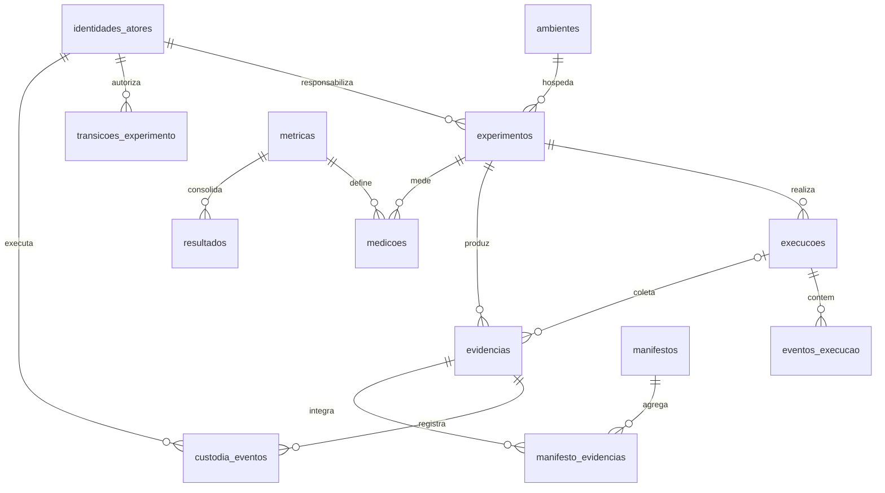

# Modelo lógico da matriz experimental v0.3

**Projeto:** Laboratório Forense Replicável / DOML-F  
**Estado:** proposta para revisão antes da geração da planilha  
**Origem:** matriz experimental v0.2 e relatório de divergências de 2026-09-17

## 1. Finalidade

Este documento define o modelo lógico da matriz experimental v0.3. A planilha v0.3 deverá ser gerada a partir desta especificação, e não editada manualmente a partir da v0.2.

O modelo separa quatro níveis de registro:

1. experimento: unidade metodológica global;
2. execução: uma realização concreta do experimento;
3. evento de execução: etapa ou ação ocorrida dentro de uma execução;
4. evidência: artefato preservado que sustenta observações e conclusões.

A fonte primária dos registros automáticos será um fluxo JSONL validado por JSON Schema. A planilha ODS será uma projeção para inspeção, análise e intercâmbio humano, nunca o mecanismo de captura durante a execução.

## 2. Convenções normativas

- Nomes técnicos usam `snake_case`, sem espaços ou acentos.
- Identificadores terminam em `_id`, exceto `exp`, mantido por compatibilidade.
- Todos os identificadores são estáveis e globalmente únicos dentro do conjunto de dados.
- Campos cronológicos terminam em `_utc` e usam ISO 8601 com fuso UTC.
- Durações usam relógio monotônico e são armazenadas em milissegundos; timestamps UTC servem à correlação cronológica.
- Atores são referenciados por `ator_id`; não se aceita identidade relevante registrada apenas como texto livre.
- Toda linha derivada de evento preserva proveniência: `source_event_id`, `source_stream_id`, `source_event_hash` e `projection_version`.
- Entidades de ciclo de vida preservam separadamente `created_*` e `finalized_*`; a finalização não sobrescreve a proveniência da criação.
- PK significa chave primária; FK significa chave estrangeira; UK significa restrição de unicidade.
- Campos derivados não podem ser digitados como fonte primária sem registro de exceção.
- Valores ausentes são vazios; não se usam `0`, `-` ou texto livre para representar ausência.
- A v0.3 preserva rastreabilidade com a v0.2, mas não mantém nomes estruturalmente incorretos.

## 3. Relacionamentos principais

## 4. Entidades

### 4.1 `ambientes`

Uma linha representa uma configuração de ambiente suficientemente estável para ser referenciada por experimentos.

| Campo | Tipo | Chave | Obrigatório | Regra |
|---|---|---:|---:|---|
| `ambiente_id` | identificador | PK | sim | único e imutável |
| `host` | texto |  | sim | identificação do host ou cluster |
| `so` | texto |  | sim | distribuição e versão |
| `kernel` | texto |  | sim | versão completa |
| `cpu` | texto |  | sim | modelo e características relevantes |
| `ram_bytes` | inteiro |  | sim | valor maior que zero |
| `armazenamento` | texto |  | sim | topologia e capacidade |
| `filesystem` | texto |  | sim | inclui versão/opções relevantes |
| `incus_versao` | versão |  | sim | versão efetivamente utilizada |
| `ansible_versao` | versão |  | sim | dado escalar, não FK |
| `python_versao` | versão |  | sim | versão efetivamente utilizada |
| `rede` | texto |  | sim | topologia/configuração relevante |
| `doml_f_versao` | versão |  | sim | versão do interpretador/especificação |
| `observacoes` | texto |  | não | complemento |

### 4.2 `identidades_atores`

Uma linha identifica uma pessoa, conta de serviço ou componente automatizado autenticável. A tabela registra referências de identidade e fingerprints, nunca tickets Kerberos, chaves privadas ou segredos.

| Campo | Tipo | Chave | Obrigatório | Regra |
|---|---|---:|---:|---|
| `ator_id` | identificador | PK | sim | único e imutável |
| `tipo_ator` | domínio |  | sim | `HUMANO`, `CONTA_SERVICO`, `ORQUESTRADOR`, `COLETOR`, `VALIDADOR` |
| `principal` | texto | UK | sim | principal Kerberos/LDAP ou identidade técnica canônica |
| `diretorio_origem` | domínio/texto |  | sim | domínio/realm/diretório emissor |
| `metodo_autenticacao` | domínio |  | sim | método efetivamente usado |
| `ssh_key_fingerprint` | texto |  | não | fingerprint, nunca a chave privada |
| `certificado_fingerprint` | texto |  | não | fingerprint do certificado, quando aplicável |
| `conta_servico` | booleano |  | sim | `TRUE` ou `FALSE` |
| `estado` | domínio |  | sim | `ATIVA`, `SUSPENSA`, `REVOGADA`, `EXPIRADA` |
| `valido_desde_utc` | timestamp |  | sim | início da validade conhecida |
| `valido_ate_utc` | timestamp |  | não | fim da validade, quando aplicável |
| `observacao` | texto |  | não | complemento |

Métodos de autenticação: `KERBEROS`, `SSH_PUBLIC_KEY`, `KERBEROS_SSH`, `CERTIFICADO`, `LOCAL_CONTROLADO`. `LOCAL_CONTROLADO` exige justificativa e não deve ser usado nas execuções principais quando a camada AAA estiver disponível.

### 4.3 `experimentos`

Uma linha representa uma unidade experimental planejada.

| Campo | Tipo | Chave | Obrigatório | Regra |
|---|---|---:|---:|---|
| `exp` | identificador | PK | sim | único e imutável |
| `inicio_utc` | timestamp |  | sim | ISO 8601 UTC |
| `fim_utc` | timestamp |  | não | posterior ou igual ao início |
| `estado_atual` | domínio |  | sim | derivável da última transição |
| `doml_versao` | versão |  | sim | versão lógica do modelo |
| `doml_hash` | texto |  | sim | hash do arquivo DOML executado |
| `commit` | referência |  | sim | revisão do código/configuração |
| `scenario_id` | referência |  | não | obrigatório quando houver cenário DOML |
| `attack_id` | referência |  | não | obrigatório para ataque/alteração controlada |
| `baseline_id` | referência |  | não | obrigatório para restauração, reprodução, drift ou idempotência |
| `ambiente_id` | identificador | FK | sim | `ambientes.ambiente_id` |
| `responsavel_id` | identificador | FK | sim | `identidades_atores.ator_id` |
| `observacoes` | texto |  | não | complemento |

### 4.4 `transicoes_experimento`

Preserva o histórico da máquina de estados.

| Campo | Tipo | Chave | Obrigatório | Regra |
|---|---|---:|---:|---|
| `transicao_id` | identificador | PK | sim | único |
| `exp` | identificador | FK | sim | `experimentos.exp` |
| `estado_anterior` | domínio |  | não | vazio somente na primeira transição |
| `estado_novo` | domínio |  | sim | transição permitida |
| `timestamp_utc` | timestamp |  | sim | ordem cronológica não decrescente |
| `ator_id` | identificador | FK | sim | `identidades_atores.ator_id` |
| `motivo` | texto |  | não | obrigatório em desvio/aborto |
| `evidencia_id` | identificador | FK | não | `evidencias.evidencia_id` |
| `observacao` | texto |  | não | complemento |

Estados: `DRAFT`, `VALIDATED`, `PROVISIONED`, `BASELINED`, `READY`, `RUNNING`, `COLLECTING`, `SEALED`, `ANALYZED`, `RESTORED`, `COMPLETED`, `ABORTED`.

### 4.5 `execucoes`

Uma linha representa uma realização completa de um experimento.

| Campo | Tipo | Chave | Obrigatório | Regra |
|---|---|---:|---:|---|
| `execucao_id` | identificador | PK | sim | único e imutável |
| `exp` | identificador | FK | sim | `experimentos.exp` |
| `numero_execucao` | inteiro | UK | sim | maior que zero; único dentro de `exp` |
| `inicio_utc` | timestamp |  | sim | ISO 8601 UTC |
| `fim_utc` | timestamp |  | não | posterior ou igual ao início |
| `inicio_monotonico_ns` | inteiro |  | sim | capturado automaticamente no mesmo host de controle |
| `fim_monotonico_ns` | inteiro |  | não | capturado automaticamente no mesmo relógio monotônico |
| `ator_disparo_id` | identificador | FK | sim | `identidades_atores.ator_id` autenticado no disparo |
| `status` | domínio |  | sim | `PLANEJADA`, `EM_EXECUCAO`, `CONCLUIDA`, `ABORTADA`, `ERRO` |
| `resultado` | domínio |  | não | domínio comum de resultados |
| `intervencao` | booleano |  | sim | somente `TRUE` ou `FALSE` |
| `descricao_intervencao` | texto |  | não | obrigatória quando intervenção for verdadeira |
| `observacao` | texto |  | não | complemento |

Restrições: PK `execucao_id`; UK (`exp`, `numero_execucao`).

### 4.6 `eventos_execucao`

Uma linha representa uma etapa ou ação dentro de uma execução.

| Campo | Tipo | Chave | Obrigatório | Regra |
|---|---|---:|---:|---|
| `evento_id` | identificador | PK | sim | único |
| `execucao_id` | identificador | FK | sim | `execucoes.execucao_id` |
| `etapa` | texto/identificador |  | sim | ordem ou código da etapa |
| `timestamp_inicio_utc` | timestamp |  | sim | ISO 8601 UTC |
| `timestamp_fim_utc` | timestamp |  | não | posterior ou igual ao início |
| `inicio_monotonico_ns` | inteiro |  | sim | contador capturado pelo callback/orquestrador |
| `fim_monotonico_ns` | inteiro |  | não | mesmo relógio e processo de controle do início |
| `relogio_origem` | texto |  | sim | host/processo que realizou a medição |
| `fase` | domínio |  | sim | fase metodológica |
| `acao` | texto/comando |  | sim | ação efetivamente realizada |
| `resultado` | domínio |  | sim | domínio comum de resultados |
| `duracao_ms` | inteiro |  | não | derivado dos contadores monotônicos |
| `intervencao` | booleano |  | sim | somente `TRUE` ou `FALSE` |
| `descricao_intervencao` | texto |  | não | obrigatória quando verdadeira |
| `observacao` | texto |  | não | complemento |

### 4.7 `streams_eventos`

Registra cada cadeia independente produzida por uma instância emissora durante uma execução.

Campos: `stream_id` (PK), `execucao_id` (FK), `emitter_type`, `emitter_instance_id`, `host`, `boot_id`, `primeira_sequencia`, `ultima_sequencia`, `quantidade_eventos`, `primeiro_hash`, `ultimo_hash`, `completo`, `aberto_em_utc`, `fechado_em_utc`, `observacao`.

Regras: reinício, perda de estado ou perda do último hash exige novo `stream_id`; a sequência não pode ser reiniciada no mesmo stream.

### 4.8 `ledger_eventos`

Registra a ordem de aceitação pelo agregador, sem alegar ordem física absoluta entre hosts.

Campos: `ledger_id` (PK), `execucao_id` (FK), `ledger_sequence` (UK dentro da execução), `received_at_utc`, `source_stream_id` (FK), `source_stream_sequence`, `source_event_id`, `source_event_hash`, `ledger_event_hash`, `observacao`.

### 4.9 `correcoes_registro`

Projeta eventos `record.corrected` sem alterar o registro original.

Campos: `correcao_id` (PK), `execucao_id` (FK opcional), `target_event_id`, `target_event_hash`, `ator_id` (FK), `timestamp_utc`, `motivo`, `campos_corrigidos`, `evento_correcao_id`, `observacao`.

Correções não podem substituir IDs, hashes, autoria, sequência ou conteúdo bruto de evidência. Alteração de evidência gera nova evidência derivada.

### 4.10 `validacoes_modelo`

Registra o portão pré-provisionamento da DOML-F.

Campos: `validacao_modelo_id` (PK), `exp` (FK), `timestamp_utc`, `tipo`, `validador`, `versao_validador`, `resultado`, `quantidade_erros`, `quantidade_avisos`, `evidencia_id` (FK opcional), `observacao`.

Domínio de `tipo`: `SINTATICA`, `SEMANTICA`, `SEGURANCA_FORENSE`.

### 4.11 `validacoes_execucao`

Registra verificação funcional ou forense durante/depois da execução.

Campos: `validacao_execucao_id` (PK), `execucao_id` (FK), `momento_utc`, `origem`, `item`, `requisito`, `esperado`, `obtido`, `resultado`, `evidencia_id` (FK opcional), `observacao`.

### 4.12 `idempotencia`

Campos: `idempotencia_id` (PK), `execucao_id` (FK), `iteracao`, `timestamp_utc`, `etapa`, `item`, `estado_antes`, `estado_depois`, `alteracao`, `tipo_alteracao`, `alteracao_esperada`, `resultado`, `duracao_ms`, `evidencia_id` (FK opcional), `observacao`.

UK recomendada: (`execucao_id`, `iteracao`, `item`).

### 4.13 `reproducao`

Campos: `reproducao_id` (PK), `execucao_origem_id` (FK), `execucao_replica_id` (FK), `item`, `categoria`, `esperado`, `estado_origem`, `estado_replica`, `criterio_comparacao`, `resultado`, `tipo_diferenca`, `criticidade`, `evidencia_origem_id` (FK opcional), `evidencia_replica_id` (FK opcional), `observacao`.

Regras: origem e réplica devem ser diferentes; o critério deve existir antes da avaliação; ambas devem possuir ambiente, DOML e commit rastreáveis.

### 4.14 `divergencias`

Registra drift ou diferença não introduzida como parte do teste.

Campos: `divergencia_id` (PK), `execucao_id` (FK), `detectada_em_utc`, `item`, `categoria`, `estado_desejado`, `estado_observado`, `tipo_divergencia`, `criticidade`, `origem_deteccao`, `evidencia_id` (FK opcional), `estado_tratamento`, `observacao`.

Domínio de `tipo_divergencia`: `AUSENTE`, `INESPERADO`, `MODIFICADO`, `DESCONHECIDO`.

### 4.15 `testes_deteccao`

Substitui a semântica da antiga aba `divergencias`, que continha alterações deliberadamente introduzidas.

Campos: `teste_deteccao_id` (PK), `execucao_id` (FK), `timestamp_introducao_utc`, `item`, `categoria`, `estado_inicial`, `alteracao_introduzida`, `estado_apos_alteracao`, `criticidade`, `metodo_deteccao`, `timestamp_deteccao_utc`, `tempo_deteccao_ms` (derivado), `evidencia_alteracao_id` (FK opcional), `evidencia_deteccao_id` (FK opcional), `resultado`, `observacao`.

### 4.16 `evidencias`

Uma evidência pertence obrigatoriamente a um experimento e opcionalmente a uma execução.

Campos: `evidencia_id` (PK), `exp` (FK), `execucao_id` (FK opcional), `coletada_em_utc`, `metodo_coleta`, `tipo`, `descricao`, `origem`, `caminho`, `formato`, `tamanho_bytes`, `hash`, `algoritmo_hash`, `versao_origem`, `estado_integridade`, `observacao`.

Regra de coerência: quando `execucao_id` estiver preenchido, a execução deverá pertencer ao mesmo `exp`.

Métodos de coleta: `SNAPSHOT`, `EXPORT`, `FILESYSTEM`, `LOGICAL`, `MEMORY`, `NETWORK_CAPTURE`, `LOG_EXPORT`, `CONFIGURATION_EXPORT`.

### 4.17 `custodia_eventos`

Implementa trilha de custódia experimental alinhada às atividades de identificação, coleta, aquisição e preservação da ISO/IEC 27037:2012, sem alegar equivalência automática à cadeia de custódia legal integral. O laboratório enfatiza a automação reprodutível da coleta, aquisição e preservação em ambientes virtualizados, efêmeros e containerizados.

Campos: `evento_custodia_id` (PK), `evidencia_id` (FK), `timestamp_utc`, `ator_id` (FK), `fase_iso_27037`, `acao`, `procedimento`, `local_origem`, `local_destino`, `responsavel_destino_id` (FK opcional), `ferramenta`, `versao_ferramenta`, `hash_antes`, `hash_depois`, `resultado_integridade`, `observacao`.

Ações: `COLETADA`, `SELADA`, `TRANSFERIDA`, `ACESSADA`, `VERIFICADA`, `ANALISADA`, `DERIVADA`, `ARQUIVADA`, `DESCARTADA`.

Fases ISO/IEC 27037: `IDENTIFICACAO`, `COLETA`, `AQUISICAO`, `PRESERVACAO`. Cada atividade relevante gera seu próprio evento; não se registram várias fases em uma única célula.

### 4.18 `manifestos`

Campos: `manifesto_id` (PK), `exp` (FK), `versao`, `criado_em_utc`, `selado_em_utc`, `algoritmo_hash`, `hash_manifesto`, `ledger_hash`, `metodo_assinatura`, `assinatura`, `responsavel_id` (FK), `chave_assinatura_fingerprint`, `estado`, `observacao`.

### 4.19 `manifesto_evidencias`

Campos: `manifesto_id` (PK/FK), `evidencia_id` (PK/FK), `ordem`, `hash_registrado`.

PK composta: (`manifesto_id`, `evidencia_id`). O hash registrado deve coincidir com o hash da evidência no momento do selamento.

### 4.20 `anomalias`

Campos: `anomalia_id` (PK), `execucao_id` (FK), `timestamp_utc`, `evento_id` (FK opcional), `categoria`, `descricao`, `origem`, `criticidade`, `impacto`, `detectado_por`, `acao`, `resultado`, `evidencia_id` (FK opcional), `recorrente`, `observacao`.

`criticidade` é domínio, não FK.

### 4.21 `metricas`

Define métricas, sem armazenar observações experimentais.

Campos: `metrica_id` (PK), `nome`, `definicao`, `unidade`, `criterio`, `metodo_calculo`, `versao`.

### 4.22 `medicoes`

Registra valores observados ou calculados.

Campos: `medicao_id` (PK), `metrica_id` (FK), `exp` (FK), `execucao_id` (FK opcional), `timestamp_utc`, `numerador`, `denominador`, `valor`, `fonte`, `resultado`, `observacao`.

Regra de coerência idêntica à de evidências para `exp` e `execucao_id`.

### 4.23 `resultados`

Campos: `resultado_id` (PK), `exp` (FK), `metrica_id` (FK), `versao_calculo`, `valor`, `unidade`, `n`, `resultado_consolidado`, `fonte`, `gerado_em_utc`, `observacao`.

UK: (`exp`, `metrica_id`, `versao_calculo`). `n` e valores consolidados devem ser derivados das medições identificadas na fonte.

## 5. Domínios comuns

| Domínio | Valores iniciais |
|---|---|
| resultado de teste | `PASS`, `FAIL`, `ERROR`, `SKIP`, `INCONCLUSIVE` |
| criticidade | `BAIXA`, `MEDIA`, `ALTA`, `CRITICA` |
| integridade | `NAO_VERIFICADA`, `VALIDA`, `INVALIDA` |
| alteração | `NENHUMA`, `ESPERADA`, `NAO_ESPERADA` |
| recorrência | `TRUE`, `FALSE`, `INDETERMINADO` |
| tratamento | `ABERTA`, `EM_ANALISE`, `ACEITA`, `CORRIGIDA`, `ENCERRADA` |
| fase ISO/IEC 27037 | `IDENTIFICACAO`, `COLETA`, `AQUISICAO`, `PRESERVACAO` |
| tipo de ator | `HUMANO`, `CONTA_SERVICO`, `ORQUESTRADOR`, `COLETOR`, `VALIDADOR` |
| método de autenticação | `KERBEROS`, `SSH_PUBLIC_KEY`, `KERBEROS_SSH`, `CERTIFICADO`, `LOCAL_CONTROLADO` |

## 6. Captura automática e fonte primária

O preenchimento manual pós-teste não é admitido como mecanismo primário para `eventos_execucao`, `streams_eventos`, `ledger_eventos`, `medicoes`, `evidencias`, `custodia_eventos` e `manifestos`.

Fluxo normativo:

1. o orquestrador cria `exp`, `execucao_id`, identifica `ator_disparo_id` e registra relógios UTC e monotônico;
2. cada instância emissora mantém stream próprio com sequência local e cadeia de hashes canonicalizada por JCS/RFC 8785;
3. o callback Ansible emite eventos de início e fim de play, task e host em JSONL;
4. coletores especializados registram evidência, tamanho, hash, ferramenta e fase ISO/IEC 27037;
5. cada registro é validado por JSON Schema antes da aceitação;
6. o agregador cria ledger separado da ordem de aceitação, sem reescrever o evento original;
7. o selador resume os streams, sela o ledger e as evidências, gera o manifesto determinístico e registra a assinatura;
8. exportadores produzem ODS e, futuramente, registros SQL sem alterar o JSONL original.

Correções manuais devem produzir um novo registro de correção ou nova versão; não se sobrescreve silenciosamente o evento original. Logs do KDC, SSH e orquestrador podem ser preservados como evidências correlatas da autenticação.

## 7. Desenho estatístico

O protocolo adota duas etapas:

1. piloto com `N0 = 5` execuções válidas por cenário para estimar variabilidade, falhas e efeitos de aquecimento;
2. amostra principal com piso de `N = 10` execuções independentes por cenário, ajustada após o piloto para obter intervalo de confiança de 95% com semilargura relativa desejada de 10%, limitada operacionalmente a `N = 30`.

As execuções piloto somente integram a amostra final se protocolo, ambiente e critérios permanecerem inalterados. O relatório deve apresentar `N`, média, desvio padrão, mediana, intervalo interquartil, mínimo, máximo, coeficiente de variação e intervalo de confiança de 95%.

O overhead da autenticação centralizada usa desenho pareado. Para cada execução válida calcula-se:

$$\Delta_i = T_{centralizada,i} - T_{baseline,i}$$

$$O_i = \frac{T_{centralizada,i}-T_{baseline,i}}{T_{baseline,i}} \times 100$$

Repetições internas de autenticação são consolidadas por execução; não são tratadas como unidades experimentais independentes. Aquecimento, ordem dos tratamentos, timeout, aborto, exclusão e tratamento de outliers devem ser definidos previamente no protocolo.

## 8. Ordem proposta das abas

1. `experimentos`
2. `transicoes_experimento`
3. `ambientes`
4. `identidades_atores`
5. `execucoes`
6. `eventos_execucao`
7. `streams_eventos`
8. `ledger_eventos`
9. `correcoes_registro`
10. `validacoes_modelo`
11. `validacoes_execucao`
12. `idempotencia`
13. `reproducao`
14. `divergencias`
15. `testes_deteccao`
16. `evidencias`
17. `custodia_eventos`
18. `manifestos`
19. `manifesto_evidencias`
20. `anomalias`
21. `metricas`
22. `medicoes`
23. `resultados`
24. `dicionario`

## 9. Critérios para autorizar a geração da ODS

- Todas as entidades possuem granularidade inequívoca.
- Toda FK possui alvo explícito.
- Não existe ciclo obrigatório de inserção entre execução e evidência.
- Campos derivados possuem regra documentada.
- Domínios fechados possuem valores iniciais definidos.
- A migração da v0.2 não descarta informação sem registro.
- O contrato JSONL/JSON Schema está definido para os registros automáticos.
- Streams locais, ledger de ingestão e correções possuem projeções separadas.
- O mapa `event-projection-map-v0.1.yaml` define cada campo e operação da projeção.
- Toda linha projetada retorna ao evento e hash que a originaram.
- As FKs de ator resolvem para uma identidade autenticável e não compartilhada.
- O protocolo estatístico define unidade experimental, piloto, regra de dimensionamento e exclusões.
- As decisões classificadas como abertas foram aceitas ou revisadas.

## 10. Referência normativa

ISO/IEC 27037:2012 — *Information technology — Security techniques — Guidelines for identification, collection, acquisition and preservation of digital evidence*. Disponível em: https://www.iso.org/standard/44381.html.
